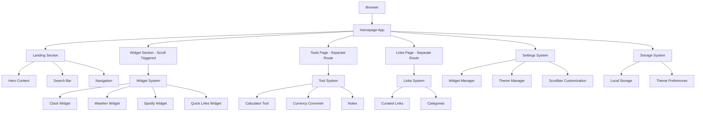

# Design Document

## Overview

The Browser Homepage feature transforms the existing Personal Portal into a fast-loading, customizable browser homepage/new tab replacement. The design leverages the existing React/Vite architecture while introducing new components optimized for quick access, customization, and daily utility. The homepage features a hero landing section followed by a customizable widget area that renders on scroll, with tools and links accessible through separate pages. The design maintains the existing dark theme aesthetic while adding theme customization options.

## Architecture

### High-Level Architecture



### Page Structure

#### Homepage Layout
1. **Landing Section** (Above the fold)
   - Hero content with animated text
   - Prominent search bar
   - Navigation to Tools and Links pages
   - Existing Personal Portal branding and style

2. **Widget Section** (Below the fold - scroll triggered)
   - Customizable widget grid
   - Lazy-loaded widgets that render on scroll
   - Only enabled widgets are displayed (default: search, clock)
   - Smooth scroll animations

### Technology Stack

- **Frontend Framework**: React 18 (existing)
- **Build Tool**: Vite (existing, optimized for fast loading)
- **Styling**: Tailwind CSS (existing, with homepage-specific utilities)
- **Animations**: Framer Motion (existing, with performance optimizations)
- **State Management**: React Context + useReducer for widget states
- **Storage**: Browser LocalStorage + IndexedDB for larger data
- **Performance**: React.lazy, Suspense, and service worker for caching

## Components and Interfaces

### Core Components

#### 1. Homepage Layout Manager
```typescript
interface HomepageLayout {
  widgets: WidgetConfig[];
  theme: ThemeConfig;
  layout: 'grid' | 'masonry' | 'custom';
  customPositions?: Record<string, Position>;
}

interface WidgetConfig {
  id: string;
  type: WidgetType;
  position: Position;
  size: WidgetSize;
  visible: boolean;
  settings: Record<string, any>;
}
```

#### 2. Widget System
```typescript
interface Widget {
  id: string;
  type: WidgetType;
  component: React.ComponentType<WidgetProps>;
  defaultSize: WidgetSize;
  configurable: boolean;
  settings?: WidgetSettings;
}

type WidgetType = 
  | 'clock'
  | 'weather' 
  | 'spotify'
  | 'quickLinks'
  | 'search';
```

#### 3. Tool System
```typescript
interface Tool {
  id: string;
  name: string;
  icon: string;
  component: React.ComponentType<ToolProps>;
  shortcut?: string;
  category: 'utility' | 'productivity' | 'entertainment';
}

interface ToolProps {
  isOpen: boolean;
  onClose: () => void;
  onMinimize?: () => void;
}
```

### Widget Components

#### Clock Widget
- **Purpose**: Display current time, date, and timezone
- **Features**: Multiple time formats, timezone selection, stopwatch/timer
- **Size Options**: Small (time only), Medium (time + date), Large (time + date + timezone)

#### Weather Widget  
- **Purpose**: Show current weather and forecast
- **Features**: Location detection, 5-day forecast, weather alerts
- **API**: OpenWeatherMap or similar service
- **Size Options**: Small (current temp), Medium (current + today), Large (5-day forecast)

#### Search Widget
- **Purpose**: Universal search with smart suggestions
- **Features**: Web search, URL navigation, search engine selection, search shortcuts
- **Integration**: Google, DuckDuckGo, Bing support
- **Shortcuts**: "g: query" for Google, "w: query" for Wikipedia, etc.

#### Quick Links Widget
- **Purpose**: Customizable bookmark grid
- **Features**: Drag-and-drop organization, custom icons, categories
- **Data Source**: User-defined links, imported bookmarks
- **Layout**: Grid with customizable columns (2x2, 3x3, 4x4)

#### Spotify Widget
- **Purpose**: Music control and now playing display
- **Features**: Current track, playback controls, recently played
- **Integration**: Existing Spotify API integration
- **Fallback**: Demo tracks when not configured

### Tool Components

#### Calculator Tool
- **Purpose**: Quick calculations without leaving homepage
- **Features**: Expression input, history, scientific mode
- **UI**: Modal overlay with calculator interface
- **Integration**: Reuse existing calculator component

#### Currency Converter Tool
- **Purpose**: Real-time currency conversion
- **Features**: Multiple currencies, rate history, favorites
- **UI**: Compact overlay with conversion interface
- **Integration**: Reuse existing converter component

#### Notes Tool
- **Purpose**: Quick note-taking and reminders
- **Features**: Markdown support, auto-save, search, can format text, a simplified notion like notetaking tool
- **Storage**: Local storage with export options
- **UI**: Expandable text area with formatting toolbar

### Settings Components

#### Widget Management
- **Purpose**: Allow users to toggle widget visibility and configure settings
- **Features**: 
  - Toggle switches for each widget type
  - Widget-specific configuration options
  - Drag-and-drop layout customization
  - Reset to defaults option
- **Default State**: Only search and clock widgets enabled
- **UI**: Settings panel accessible via gear icon or keyboard shortcut

#### Theme Customization
- **Purpose**: Visual customization options
- **Features**: 
  - Multiple color theme presets (default: existing Personal Portal dark theme)
  - Custom accent color selection
  - Background options (solid, gradient, subtle patterns)
  - Animation toggle settings
- **Default Theme**: Existing Personal Portal aesthetic (black background, red/orange accents)
- **Integration**: Builds on existing theme system from Personal Portal

#### Custom Scrollbar
- **Purpose**: Enhanced visual experience with custom browser scrollbar
- **Features**:
  - Thin, semi-transparent scrollbar design
  - Smooth scrolling behavior
  - Auto-hide when not in use
  - Theme-aware colors that match selected color scheme
- **Implementation**: CSS scrollbar customization with cross-browser support

## Data Models

### User Preferences
```typescript
interface UserPreferences {
  layout: HomepageLayout;
  theme: {
    mode: 'light' | 'dark' | 'auto';
    accentColor: string;
    backgroundType: 'solid' | 'gradient' | 'image';
    animations: boolean;
  };
  widgets: {
    enabled: WidgetType[];
    settings: Record<WidgetType, any>;
    visibility: Record<WidgetType, boolean>;
  };
  search: {
    defaultEngine: 'google' | 'duckduckgo' | 'bing';
    shortcuts: Record<string, string>;
  };
  privacy: {
    analytics: boolean;
    externalAPIs: boolean;
  };
}

// Default widget visibility - only search and clock enabled by default
const DEFAULT_WIDGET_VISIBILITY: Record<WidgetType, boolean> = {
  search: true,
  clock: true,
  weather: false,
  spotify: false,
  quickLinks: false,
  notes: false,
  calculator: false,
  currencyConverter: false
};
```

### Widget Data
```typescript
interface WidgetData {
  clock: {
    timezone: string;
    format: '12h' | '24h';
    showSeconds: boolean;
  };
  weather: {
    location: string;
    units: 'metric' | 'imperial';
    showForecast: boolean;
  };
  quickLinks: {
    links: QuickLink[];
    columns: number;
    showLabels: boolean;
  };
  spotify: {
    showControls: boolean;
    showAlbumArt: boolean;
  };
}
```

### Performance Optimizations

#### Loading Strategy
1. **Critical Path**: Load essential widgets first (clock, search)
2. **Progressive Loading**: Load secondary widgets after initial render
3. **Lazy Loading**: Load tools only when accessed
4. **Service Worker**: Cache static assets and API responses

#### Bundle Optimization
```javascript
// Vite config optimizations for homepage
export default {
  build: {
    rollupOptions: {
      output: {
        manualChunks: {
          'vendor': ['react', 'react-dom'],
          'widgets': ['./src/widgets/index.js'],
          'tools': ['./src/tools/index.js']
        }
      }
    }
  },
  // Optimize for homepage use case
  define: {
    'process.env.HOMEPAGE_MODE': true
  }
}
```

## Error Handling

### Error Boundaries
- **Widget Error Boundary**: Isolate widget failures
- **Tool Error Boundary**: Prevent tool crashes from affecting homepage
- **API Error Boundary**: Handle external API failures gracefully

### Fallback Strategies
- **Offline Mode**: Show cached content when network unavailable
- **Widget Failures**: Display error state with retry option
- **API Failures**: Use cached data or disable affected features
- **Storage Failures**: Graceful degradation to default settings

### Error Recovery
```typescript
interface ErrorRecovery {
  retryAttempts: number;
  fallbackData: any;
  userNotification: boolean;
  reportError: boolean;
}
```

## Testing Strategy

### Unit Testing
- **Widget Components**: Test rendering, interactions, and state management
- **Tool Components**: Test functionality and modal behavior
- **Utility Functions**: Test search, storage, and API helpers
- **Performance**: Test loading times and bundle sizes

### Integration Testing
- **Widget System**: Test widget loading, positioning, and communication
- **Settings System**: Test preference saving and loading
- **Tool Integration**: Test tool opening, closing, and data persistence

### End-to-End Testing
- **Homepage Setup**: Test setting as browser homepage
- **User Workflows**: Test common user interactions
- **Cross-Browser**: Test on Chrome, Firefox, Safari, Edge
- **Performance**: Test loading times on various connection speeds

### Performance Testing
```javascript
// Performance benchmarks
const performanceTargets = {
  initialLoad: '< 2 seconds',
  widgetRender: '< 100ms',
  toolOpen: '< 200ms',
  searchResponse: '< 50ms'
};
```

### Browser Compatibility Testing
- **Chrome**: Full feature support
- **Firefox**: Full feature support
- **Safari**: Full feature support with webkit prefixes
- **Edge**: Full feature support
- **Mobile Browsers**: Responsive design testing

## Security Considerations

### Data Privacy
- **Local Storage Only**: No external data transmission for preferences
- **API Minimization**: Minimal data sent to external APIs
- **User Consent**: Clear opt-in for external services
- **Data Encryption**: Sensitive data encrypted in local storage

### Content Security Policy
```javascript
const csp = {
  'default-src': "'self'",
  'script-src': "'self' 'unsafe-inline'",
  'style-src': "'self' 'unsafe-inline'",
  'img-src': "'self' data: https:",
  'connect-src': "'self' https://api.openweathermap.org https://api.spotify.com"
};
```

### Input Validation
- **Search Input**: Sanitize and validate search queries
- **URL Input**: Validate URLs before navigation
- **Settings Input**: Validate all user preferences
- **Tool Input**: Validate calculator expressions and currency inputs

## Accessibility

### WCAG Compliance
- **Keyboard Navigation**: Full keyboard accessibility
- **Screen Reader Support**: Proper ARIA labels and roles
- **Color Contrast**: Meet WCAG AA standards
- **Focus Management**: Clear focus indicators

### Accessibility Features
```typescript
interface AccessibilityConfig {
  highContrast: boolean;
  reducedMotion: boolean;
  screenReader: boolean;
  keyboardOnly: boolean;
}
```

## Deployment and Distribution

### Browser Extension Option
- **Chrome Extension**: Package as Chrome extension for easy installation
- **Firefox Add-on**: Firefox-compatible version
- **Installation Guide**: Clear instructions for setting as homepage

### Hosting Options
- **GitHub Pages**: Free hosting with custom domain support
- **Netlify/Vercel**: Enhanced performance and CDN
- **Self-Hosted**: Instructions for personal server deployment

### Update Mechanism
- **Service Worker**: Automatic updates for cached content
- **Version Check**: Notify users of available updates
- **Migration**: Handle settings migration between versions