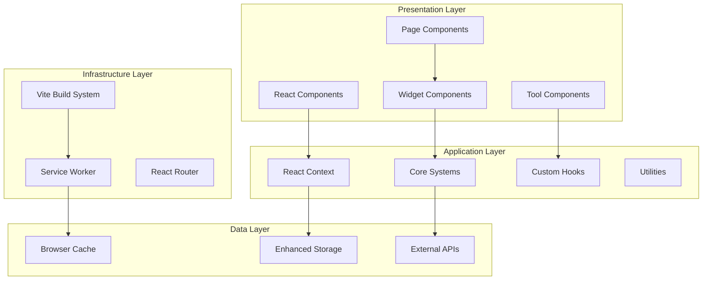
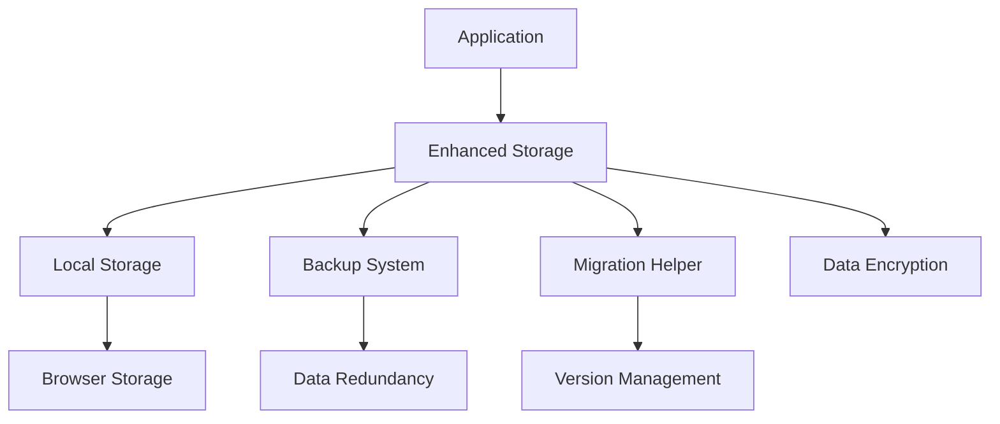
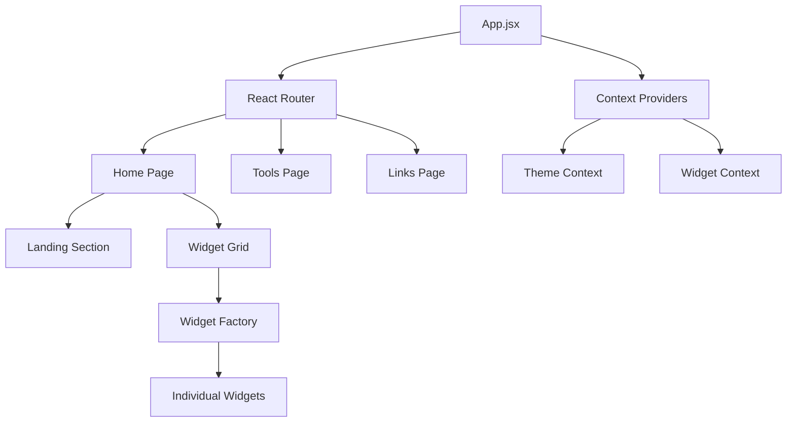
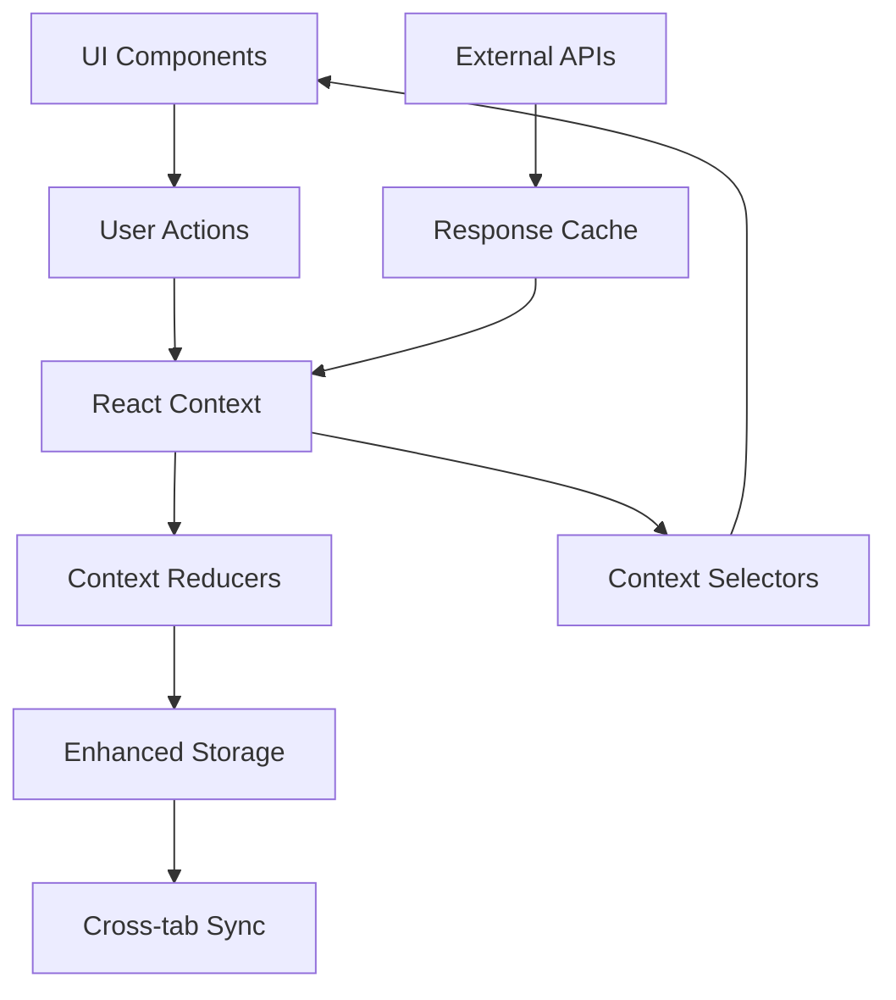
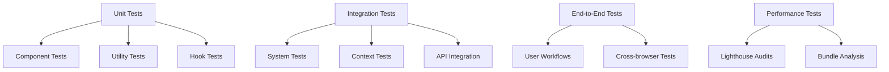
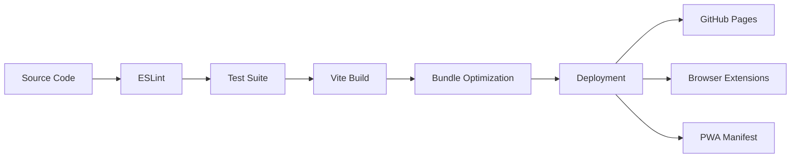

# Personal Portal - Architecture Documentation

## Table of Contents
1. [Project Overview](#project-overview)
2. [Architecture Principles](#architecture-principles)
3. [System Architecture](#system-architecture)
4. [Code Organization](#code-organization)
5. [Core Systems](#core-systems)
6. [Component Architecture](#component-architecture)
7. [Data Flow](#data-flow)
8. [Performance Architecture](#performance-architecture)
9. [Testing Architecture](#testing-architecture)
10. [Deployment Architecture](#deployment-architecture)
11. [Security Architecture](#security-architecture)
12. [Development Workflow](#development-workflow)

## Project Overview

Personal Portal is a modern, customizable browser homepage application built with React 18, Vite, and a modular widget system. It serves as a centralized dashboard for productivity tools, quick links, and personalized widgets with a focus on performance, accessibility, and extensibility.

### Key Features
- **Modular Widget System**: Extensible architecture for adding custom widgets
- **Progressive Loading**: Optimized loading with lazy components and code splitting
- **Offline Support**: Service worker implementation with caching strategies
- **Cross-Platform**: Web app, browser extensions (Chrome/Firefox), and PWA support
- **Comprehensive Testing**: Unit, integration, E2E, and performance testing
- **Accessibility First**: WCAG AA compliance with full keyboard navigation

## Architecture Principles

### 1. **Modularity & Extensibility**
- Component-based architecture with clear separation of concerns
- Plugin-like widget system for easy extension
- Configurable and swappable components

### 2. **Performance First**
- Progressive loading and lazy components
- Code splitting by feature and vendor libraries
- Optimized bundle sizes with manual chunking
- Service worker caching strategies

### 3. **User Experience**
- Responsive design with mobile-first approach
- Smooth animations with Framer Motion
- Offline-first functionality
- Accessibility compliance (WCAG AA)

### 4. **Developer Experience**
- Modern tooling (Vite, ESLint, Vitest)
- Comprehensive testing suite
- Hot module replacement in development
- Clear documentation and code organization

### 5. **Reliability & Resilience**
- Error boundaries at multiple levels
- Graceful degradation for API failures
- Data persistence with backup strategies
- Progressive enhancement

## System Architecture



## Code Organization

### Directory Structure

```
src/
├── components/           # Reusable UI components
│   ├── __tests__/       # Component unit tests
│   ├── homepage/        # Homepage-specific components
│   ├── theme/           # Theme-related components
│   ├── tools/           # Tool components (Calculator, etc.)
│   └── widgets/         # Widget components
├── contexts/            # React Context providers
├── data/               # Static data and configurations
├── fonts/              # Custom font files
├── hooks/              # Custom React hooks
├── pages/              # Page-level components
├── systems/            # Core system modules
├── test/               # Testing utilities and configurations
│   ├── e2e/            # End-to-end tests
│   ├── integration/    # Integration tests
│   └── performance/    # Performance tests
└── utils/              # Utility functions and helpers
```

### Component Categories

#### 1. **Core Components** (`src/components/`)
- **App.jsx**: Main application component with routing
- **Header.jsx**: Navigation and branding
- **PageTransition.jsx**: Page transition animations
- **ErrorBoundary.jsx**: Error handling components

#### 2. **Widget Components** (`src/components/widgets/`)
- **ClockWidget.jsx**: Time and date display
- **SearchWidget.jsx**: Universal search with suggestions
- **WeatherWidget.jsx**: Weather information and forecast
- **SpotifyWidget.jsx**: Music player integration

#### 3. **Tool Components** (`src/components/tools/`)

- **Notes.jsx**: Note-taking with markdown support

#### 4. **System Components** (`src/systems/`)
- **WidgetRegistry.js**: Widget registration and management
- **WidgetFactory.jsx**: Widget instantiation and lifecycle

## Core Systems

### 1. Widget System Architecture


#### Widget Registry (`src/systems/WidgetRegistry.js`)
- **Purpose**: Central registry for all available widgets
- **Responsibilities**:
  - Widget registration and discovery
  - Component mapping and metadata management
  - Type-based widget filtering
  - Development-time widget validation

#### Widget Factory (`src/systems/WidgetFactory.jsx`)
- **Purpose**: Widget instantiation with proper configuration
- **Responsibilities**:
  - Progressive loading implementation
  - Error boundary wrapping
  - Props injection and context binding
  - Performance monitoring

#### Widget Context (`src/contexts/WidgetContext.jsx`)
- **Purpose**: Global widget state management
- **Responsibilities**:
  - Widget visibility state
  - Settings persistence
  - Layout management
  - State synchronization

### 2. Storage Architecture



#### Enhanced Storage (`src/utils/enhancedStorage.js`)
- **Features**:
  - Automatic data backup and recovery
  - Version-based migration system
  - Data encryption for sensitive information
  - Quota management and cleanup
  - Cross-tab synchronization

### 3. Performance Architecture

#### Code Splitting Strategy
```javascript
// Manual chunks configuration in vite.config.js
manualChunks: (id) => {
  if (id.includes('node_modules')) {
    if (id.includes('react')) return 'react-vendor'
    if (id.includes('framer-motion')) return 'motion'
    return 'vendor'
  }
  if (id.includes('/widgets/')) return 'widgets'
  if (id.includes('/tools/')) return 'tools'
  return 'main'
}
```

#### Progressive Loading (`src/utils/lazyLoading.jsx`)
- **Critical Path**: Search and Clock widgets load immediately
- **Secondary Widgets**: Weather, Spotify load progressively
- **Tools**: Lazy-loaded on demand
- **Fallback Components**: Skeleton loaders during loading

#### Service Worker Strategy (`public/sw.js`)
- **Cache First**: Static assets (CSS, JS, images)
- **Network First**: API calls with cache fallback
- **Stale While Revalidate**: Dynamic content updates

## Component Architecture

### Component Hierarchy



### Component Design Patterns

#### 1. **Higher-Order Components (HOCs)**
```javascript
// Error boundary wrapper
export const withErrorBoundary = (Component, errorProps) => {
  return (props) => (
    <ErrorBoundary {...errorProps}>
      <Component {...props} />
    </ErrorBoundary>
  )
}
```

#### 2. **Render Props Pattern**
```javascript
// Progressive loading component
export const ProgressiveLoader = ({ children, fallback, condition }) => {
  return condition ? children() : fallback
}
```

#### 3. **Compound Components**
```javascript
// Settings panel with sub-components
<SettingsPanel>
  <SettingsPanel.Header />
  <SettingsPanel.Content />
  <SettingsPanel.Actions />
</SettingsPanel>
```

## Data Flow

### State Management Architecture



### Data Flow Patterns

#### 1. **Widget State Flow**
1. User interacts with widget
2. Widget dispatches action to Widget Context
3. Context reducer updates state
4. Enhanced Storage persists changes
5. UI re-renders with new state

#### 2. **Settings Persistence Flow**
1. Settings change in UI
2. Context updates immediately (optimistic)
3. Enhanced Storage saves asynchronously
4. Backup system creates redundant copy
5. Cross-tab synchronization broadcasts changes

#### 3. **API Integration Flow**
1. Component requests data
2. Check cache first (if available)
3. Make API request if cache miss
4. Update cache with response
5. Update component state
6. Handle errors gracefully

## Performance Architecture

### Bundle Optimization

#### Chunk Analysis
```javascript
// Bundle size targets
{
  "main": "< 200KB",
  "vendor": "< 300KB", 
  "widgets": "< 100KB",
  "tools": "< 80KB"
}
```

#### Loading Strategy
1. **Critical Path**: HTML, CSS, main JS bundle
2. **Above Fold**: Search widget, Clock widget
3. **Below Fold**: Weather, Spotify widgets (lazy loaded)
4. **On Demand**: Tools, Settings panels

### Runtime Performance

#### Memory Management
- Component cleanup in useEffect
- Event listener removal
- Interval/timeout cleanup
- WeakMap usage for component references

#### Rendering Optimization
- React.memo for expensive components
- useMemo for expensive calculations
- useCallback for stable function references
- Virtual scrolling for large lists

## Testing Architecture

### Testing Strategy



### Test Categories

#### 1. **Unit Tests** (`src/**/__tests__/`)
- Component rendering and behavior
- Utility function logic
- Custom hook functionality
- Error handling scenarios

#### 2. **Integration Tests** (`src/test/integration/`)
- Widget system integration
- Context provider interactions
- Storage system functionality
- API integration flows

#### 3. **End-to-End Tests** (`src/test/e2e/`)
- Complete user workflows
- Cross-browser compatibility
- Performance benchmarks
- Accessibility compliance

#### 4. **Performance Tests** (`src/test/performance/`)
- Bundle size analysis
- Loading time measurements
- Memory usage monitoring
- Lighthouse audits

### Testing Tools

- **Vitest**: Unit and integration testing
- **React Testing Library**: Component testing
- **Playwright**: End-to-end testing
- **Lighthouse CI**: Performance auditing
- **MSW**: API mocking

## Deployment Architecture

### Build Pipeline



### Deployment Targets

#### 1. **Web Application**
- **Platform**: GitHub Pages
- **Build**: Static site generation
- **CDN**: GitHub's global CDN
- **SSL**: Automatic HTTPS

#### 2. **Browser Extensions**
- **Chrome**: Chrome Web Store
- **Firefox**: Firefox Add-ons
- **Build**: Extension-specific manifests
- **Distribution**: Store approval process

#### 3. **Progressive Web App**
- **Manifest**: PWA configuration
- **Service Worker**: Offline functionality
- **Installation**: Add to home screen
- **Updates**: Automatic background updates

### CI/CD Pipeline

#### GitHub Actions Workflow
1. **Code Quality**: Linting and formatting
2. **Testing**: Unit, integration, and E2E tests
3. **Build**: Production bundle creation
4. **Performance**: Lighthouse audits
5. **Deploy**: Multi-target deployment
6. **Monitoring**: Post-deployment checks

## Security Architecture

### Security Measures

#### 1. **Content Security Policy**
```javascript
// CSP headers for extension
"content_security_policy": {
  "extension_pages": "script-src 'self'; object-src 'self';"
}
```

#### 2. **Data Protection**
- Local storage encryption for sensitive data
- No external data transmission without consent
- API key protection in environment variables
- Input sanitization and validation

#### 3. **Extension Security**
- Minimal permissions requested
- Secure communication between components
- Content script isolation
- Background script security

### Privacy Considerations

#### Data Handling
- **Local First**: All data stored locally by default
- **Optional APIs**: External integrations are opt-in
- **No Tracking**: No analytics without explicit consent
- **Data Export**: Users can export their data

## Development Workflow

### Development Environment

#### Setup Requirements
- Node.js 18+
- npm or yarn
- Modern browser for testing
- Git for version control

#### Development Commands
```bash
npm run dev          # Start development server
npm run build        # Production build
npm run test         # Run test suite
npm run lint         # Code linting
npm run preview      # Preview production build
```

### Code Standards

#### Style Guide
- **ESLint**: Airbnb configuration with React rules
- **Prettier**: Automatic code formatting
- **Naming**: camelCase for variables, PascalCase for components
- **Files**: kebab-case for file names

#### Component Guidelines
- Functional components with hooks
- PropTypes or TypeScript for type checking
- Accessibility attributes required
- Error boundaries for error handling
- Performance optimization with React.memo

### Git Workflow

#### Branch Strategy
- **main**: Production-ready code
- **develop**: Integration branch
- **feature/***: Feature development
- **hotfix/***: Critical fixes

#### Commit Convention
```
type(scope): description

feat(widgets): add weather widget
fix(storage): resolve data corruption issue
docs(readme): update installation guide
```

## Future Architecture Considerations

### Scalability Plans

#### 1. **Micro-Frontend Architecture**
- Independent widget deployment
- Runtime widget loading
- Cross-team development support

#### 2. **Plugin System**
- Third-party widget development
- Plugin marketplace
- Sandboxed execution environment

#### 3. **Cloud Integration**
- Optional cloud sync
- Cross-device synchronization
- Backup and restore services

### Technology Evolution

#### Potential Upgrades
- **React 19**: Concurrent features and Suspense improvements
- **Vite 6**: Enhanced build performance
- **Web Components**: Framework-agnostic widgets
- **WebAssembly**: Performance-critical computations

---

## Conclusion

The Personal Portal architecture is designed for modularity, performance, and extensibility. The widget-based system allows for easy customization while maintaining high performance through progressive loading and code splitting. The comprehensive testing strategy ensures reliability, while the multi-platform deployment approach maximizes accessibility.

The architecture supports both current needs and future growth, with clear patterns for extending functionality and maintaining code quality. The focus on user experience, developer experience, and performance creates a solid foundation for long-term success.

For detailed implementation examples and API documentation, refer to the individual component and system documentation files.